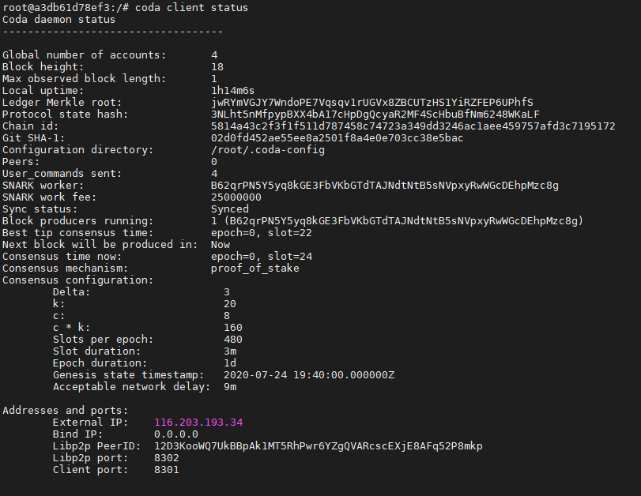

# Install Sandbox node

### 1. Ubuntu setup

Update the packages on the server to the latest versions:

```text
sudo apt update
```

Install Docker:

```text
sudo apt install docker.io curl -y
```

Activate Docker:

```text
sudo systemctl start docker
sudo systemctl enable docker
```

### 2. Launching a Sandbox node

```text
sudo docker run \
--publish 3085:3085 \
-d \
--name coda \
codaprotocol/coda-demo:pickles-sandbox
```


If after running the command your node crashes with error 132, you need to start the node with a different docker image `codaprotocol/coda-demo:pickles-sandbox-classic` 

Follow the link below!




### 3. Viewing logs

```text
sudo docker logs --follow coda
```

Now go to the Challenge \#1

### 4. Using CLI


This step only needs to be performed starting from Challenge \#2


To access any [Coda CLI](https://codaprotocol.com/docs/cli-reference) commands:

```text
sudo docker exec -it coda bash
```

For example, checking the status, the state of the node:

```text
coda client status
```



### 5. Additional commands

Exiting CLI mode:

```text
exit
```

Stopping a Coda container:

```text
sudo docker stop coda
```

 Removing a Coda container:

```text
sudo docker rm coda
```

