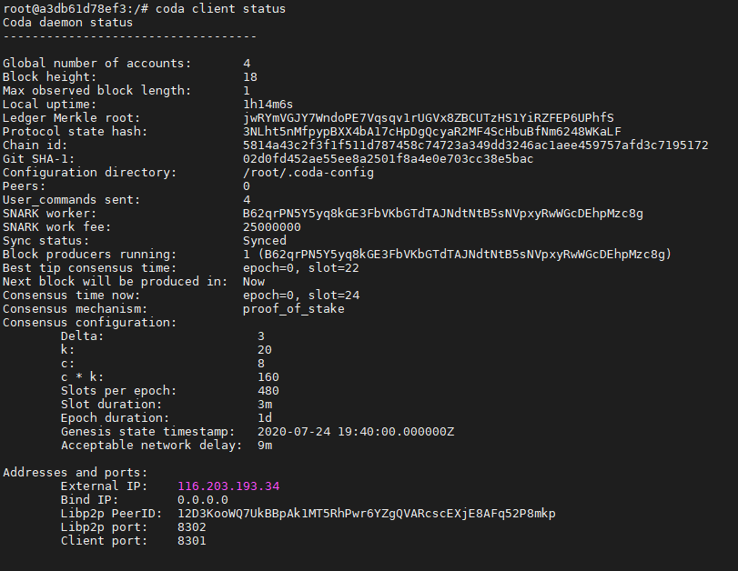

# Установка Sandbox ноды

### 1. Настройка Ubuntu

Обновляем пакеты на сервере до новейших версий:

```text
sudo apt update
```

Установим Докер:

```text
sudo apt install docker.io curl -y
```

Активируем Докер:

```text
sudo systemctl start docker
sudo systemctl enable docker
```

### 2. Запуск Sandbox ноды

```text
sudo docker run \
--publish 3085:3085 \
-d \
--name coda \
codaprotocol/coda-demo:pickles-sandbox
```


Если после запуска команды у вас нода крашится с ошибкой 132 вам нужно запустить ноду с другим образом докера`codaprotocol/coda-demo:pickles-sandbox-classic`

Перейдите по ссылке ниже!




### 3. Просмотр логов

```text
sudo docker logs --follow coda
```

Теперь переходим к Challenge \#1

### 4. Использование CLI


Этот шаг нужно выполнять только начиная с пункта Challenge \#2


Для доступа к любым командам [Coda CLI](https://codaprotocol.com/docs/cli-reference):

```text
sudo docker exec -it coda bash
```

Например проверка статуса, состояния узла:

```text
coda client status
```



